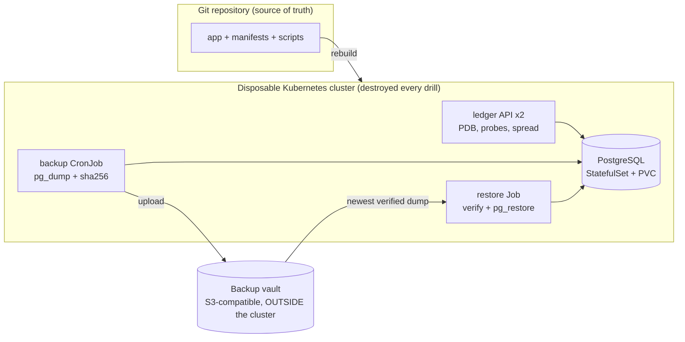

# Phoenix Drill

[](https://github.com/SivaNagaKalyan/phoenix-drill/actions/workflows/ci.yml)
[](https://github.com/SivaNagaKalyan/phoenix-drill/actions/workflows/phoenix.yml)

**Every week, this repository destroys its entire production environment and rebuilds it from code. Then it proves, with a checksum, that no data was lost except what the recovery objective allows.**

Most teams say they have disaster recovery. Few have ever run it. This project turns disaster recovery from a document into an automated, measured, continuously verified test.

## What the drill proves

| Claim | How it is proven |
|---|---|
| The whole system is defined in code | The cluster, database, secrets and app are deleted, then recreated with no manual steps |
| Backups actually restore | Data is restored into a brand new cluster with new credentials |
| Restored data is correct | SHA-256 checksum over every row must match the pre-disaster value |
| Data loss is measured, not guessed | Writes made after the last backup are counted and must be exactly the records lost |
| Recovery time is known | Time from "cluster gone" to "data verified" is measured and must stay under budget |
| The recovered system is protected again | The first backup after recovery must succeed |

Results from every scheduled run are committed to [`results/history.csv`](results/history.csv), and each run's report appears in the workflow summary. A failed drill fails the build and is recorded as a failure.

## Architecture



The one rule the design is built around: **the backups must not live in the blast radius.** The vault runs outside the cluster, so deleting the cluster deletes everything except the backups. See [ADR 0001](docs/adr/0001-backups-outside-blast-radius.md).

## The drill, phase by phase

1. **Preflight**: remove any leftovers. A drill that reuses old state proves nothing.
2. **Provision**: create the vault, the cluster, the database and the app from the repository.
3. **Seed**: write a deterministic dataset through the API and record its checksum.
4. **Backup**: run the same backup job that runs on schedule.
5. **Late writes**: write more records after the backup. These should be lost, and counting them measures the real data loss.
6. **Disaster**: delete the entire cluster. Nodes, volumes, secrets, all of it.
7. **Recovery**: rebuild the cluster from code, restore the newest backup, redeploy the app.
8. **Verify**: compare count and checksum. Recovery time is only stopped once data is proven correct.
9. **Re-protect**: enable backups and prove a new backup succeeds.

## Quick start

Nothing needs to be installed on your machine.

**GitHub Actions**: open the Actions tab, pick `phoenix-drill`, click *Run workflow*.

**Codespaces**: click *Code, Codespaces, Create codespace*, then:

```bash
make phoenix        # full drill, about 5 to 10 minutes
```

Other targets:

```bash
make up             # bring the stack up without a drill
make seed           # write records
make backup         # on-demand backup
make backups        # list backups in the vault
make destroy        # delete the cluster, keep the vault
make restore        # restore newest backup into the current cluster
make down           # delete everything, including backups
make lint test      # every check CI runs
```

Tunables: `RECORDS`, `LATE_WRITES`, `RTO_BUDGET_SECONDS`.

## Engineering decisions

| Decision | Why |
|---|---|
| Vault outside the cluster | Deleting the cluster must never delete backups ([ADR 0001](docs/adr/0001-backups-outside-blast-radius.md)) |
| Logical dumps with sha256 manifests | Portable across versions and clusters, and corruption is caught before restore ([ADR 0002](docs/adr/0002-logical-backups-with-integrity-checks.md)) |
| Backup schedule ships suspended | A freshly rebuilt empty database must never become the newest backup |
| Backup job refuses an empty database | Second line of defense for the same failure |
| Restore uses `--no-owner --single-transaction --clean` | Works with new credentials, is all or nothing, and is safe to re-run |
| RTO clock stops at verified data, not at "pods running" | Running pods with wrong data is an outage, not a recovery |
| Deterministic seed data | Anyone can predict the exact dataset and checksum independently |
| Restricted Pod Security, non-root, read-only filesystems, default-deny ingress | Security posture is identical before and after a rebuild |
| Every tool and image pinned in one file | Rebuilds are reproducible; checksums verify every downloaded binary |
| Failed drills are recorded | A history of only passes is not evidence |

Failure modes found while building this are written up in [docs/findings.md](docs/findings.md).

## Moving this to a real cloud

The drill targets a local cluster so it is free and repeatable. The same structure maps to cloud with these changes:

| Here | In production |
|---|---|
| Vault container on the host | Object storage in a separate account or project, with versioning, object lock and cross-region replication |
| Vault root credentials in the backup job | Workload identity with a write-only role for backups and a read-only role for restores |
| Hourly logical dumps | Continuous WAL archiving (point-in-time recovery) or managed database snapshots, with logical dumps as a second layer |
| `kind load` image cache | Private registry with replication, images referenced by digest |
| Secrets generated per cluster | External secret manager |

## Repository layout

```
app/               ledger service (FastAPI + PostgreSQL), tests, Dockerfile
deploy/data/       namespace, network policies, PostgreSQL, backup CronJob
deploy/app/        ledger Deployment, Service, PodDisruptionBudget
deploy/jobs/       restore Job
kind/              cluster definition
scripts/           every operation, one script each, all idempotent
tools/             pinned versions and checksum-verified installer
docs/              ADRs, restore runbook, postmortem template, findings
results/           history of every recorded drill
```

## Operations

* [Runbook: restore from backup](docs/runbooks/restore-from-backup.md)
* [Postmortem template](docs/postmortems/TEMPLATE.md)

## License

MIT
